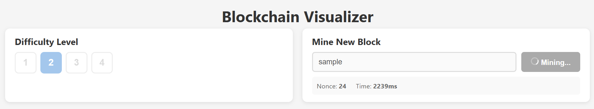
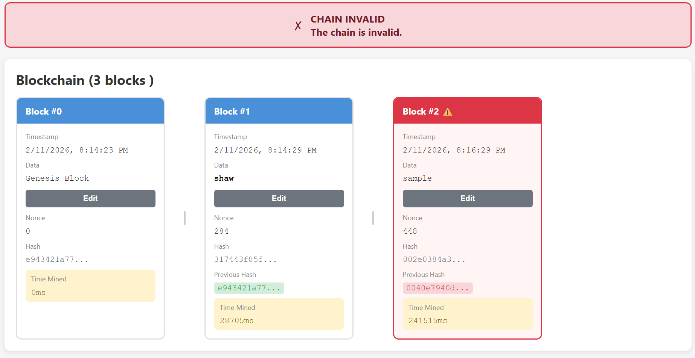
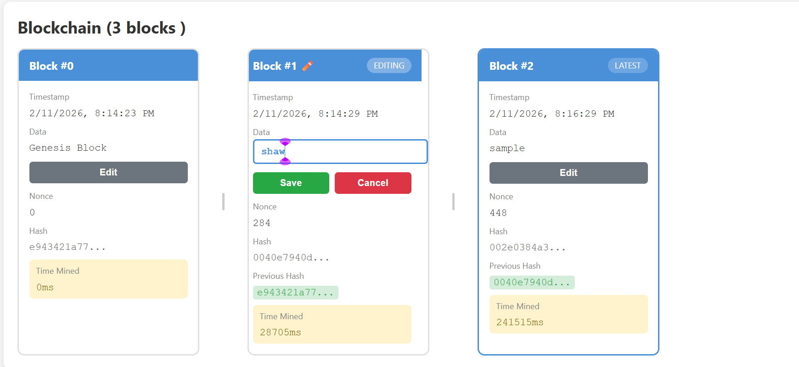
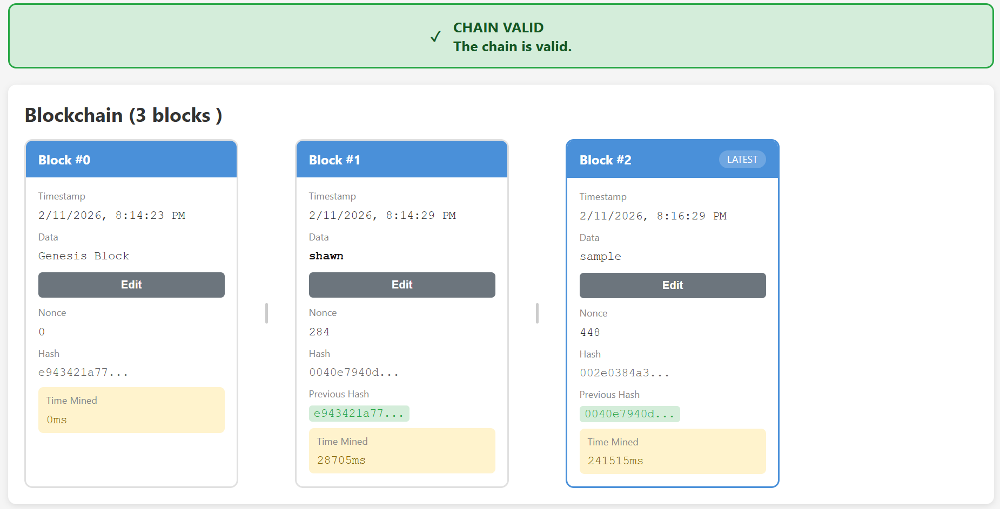

Blockchain Visualizer

This is a blockchain visualizer where you can add blocks, edit blocks
and see how changing one block, affects the entire chain. 

How to run the project:

1. First you have to `npm i` within the folder inside the terminal.
2. To run the project, type `npm start` in the terminal.

Screenshots of the project: 

